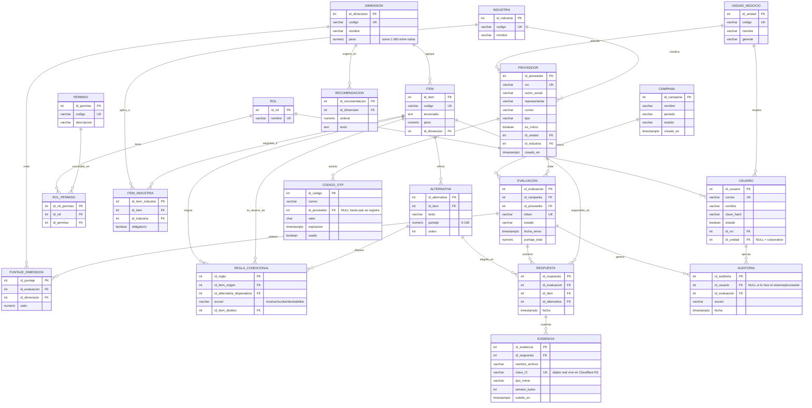

# Arquitectura de Datos — Plataforma de Sostenibilidad de Proveedores

Este documento describe la arquitectura del modelo de base de datos relacional de la plataforma (20 tablas normalizadas, incluyendo la gestión de evidencias documentales).

Motor: **PostgreSQL 16** sobre **Neon** (servidor en la nube), región `us-east-2` (AWS). Archivo ejecutable del esquema: `base-datos/esquema_inicial.sql`.

---

## 1. Modelo Entidad-Relación

**Notas de cardinalidad relevantes:**
- `ROL_PERMISO` e `ITEM_INDUSTRIA` son tablas de unión que resuelven las dos relaciones muchos-a-muchos reales del modelo (`ROL`↔`PERMISO` y `ITEM`↔`INDUSTRIA`); todo lo demás es 1↔N.
- `ITEM` participa dos veces en `REGLA_CONDICIONAL` (como `id_item_origen` y como `id_item_destino`) — es una relación reflexiva sobre la misma tabla.
- El archivo binario de `EVIDENCIA` **no vive en PostgreSQL**: la tabla solo guarda metadata y la clave del objeto en Cloudflare R2 (compatible S3). Ver §5.

---

## 2. Tablas normalizadas — verificación de forma normal

Las 20 tablas cumplen **3FN** (Tercera Forma Normal):

| Regla | Cómo se cumple |
|---|---|
| **1FN** (atómica, sin grupos repetidos) | Ningún campo almacena listas ni valores compuestos. Las relaciones N:N (`ROL`↔`PERMISO`, `ITEM`↔`INDUSTRIA`) se resuelven con tablas de unión en vez de columnas repetidas o arrays. |
| **2FN** (sin dependencias parciales) | Toda PK es de un solo atributo (`SERIAL`, un entero autoincremental) salvo las tablas de unión, cuyos atributos no-clave (`obligatorio`) dependen de la fila completa, no de una parte de una clave compuesta — de hecho se usa una PK sintética (`id_rol_permiso`, `id_item_industria`) en vez de clave compuesta, evitando el problema de raíz. |
| **3FN** (sin dependencias transitivas) | Ningún atributo no-clave depende de otro atributo no-clave. Ejemplos verificados: `PROVEEDOR.id_unidad` apunta directo a `UNIDAD_NEGOCIO`, no se duplica `nombre`/`gerente` de la unidad dentro de `PROVEEDOR`; `RESPUESTA` no repite `enunciado` del ítem ni `texto` de la alternativa, solo sus FK; `EVALUACION.puntaje_total` y `PUNTAJE_DIMENSION.valor` son **derivados** (calculados por el motor de calificación, no capturados de otra tabla) — su redundancia es intencional como caché de un cálculo costoso, documentada explícitamente en `provider-portal/SKILL.md`, no un fallo de normalización. |

**Desnormalización deliberada (única, y justificada):** `EVALUACION.puntaje_total` y `PUNTAJE_DIMENSION.valor` podrían recalcularse en cada lectura desde `RESPUESTA` + `ALTERNATIVA` + `ITEM` + `DIMENSION`, pero se persisten porque (a) el resultado no debe cambiar retroactivamente si luego se edita el banco de ítems, y (b) el dashboard (RF22) los lee con alta frecuencia. Es una vista materializada manual, no una violación de 3FN — el dato fuente (`RESPUESTA`) sigue siendo la única fuente de verdad y el recálculo es reproducible.

---

## 3. Claves primarias y foráneas

| Tabla | PK | FK → tabla referenciada | Restricciones adicionales |
|---|---|---|---|
| `rol` | `id_rol` | — | `nombre` UNIQUE |
| `permiso` | `id_permiso` | — | `codigo` UNIQUE |
| `rol_permiso` | `id_rol_permiso` | `id_rol`→rol, `id_permiso`→permiso | UNIQUE(`id_rol`,`id_permiso`) |
| `unidad_negocio` | `id_unidad` | — | `codigo` UNIQUE |
| `usuario` | `id_usuario` | `id_rol`→rol (NOT NULL), `id_unidad`→unidad_negocio (NULL = corporativo) | `correo` UNIQUE |
| `industria` | `id_industria` | — | `codigo` UNIQUE |
| `proveedor` | `id_proveedor` | `id_unidad`→unidad_negocio (NOT NULL), `id_industria`→industria (NULL hasta registro) | `ruc` UNIQUE, `tipo` CHECK IN ('Retail','No retail') |
| `dimension` | `id_dimension` | — | `codigo` UNIQUE |
| `item` | `id_item` | `id_dimension`→dimension (NOT NULL) | `codigo` UNIQUE |
| `item_industria` | `id_item_industria` | `id_item`→item, `id_industria`→industria | UNIQUE(`id_item`,`id_industria`) |
| `alternativa` | `id_alternativa` | `id_item`→item (NOT NULL) | `puntaje` CHECK BETWEEN 0 AND 100 |
| `regla_condicional` | `id_regla` | `id_item_origen`→item, `id_alternativa_disparadora`→alternativa, `id_item_destino`→item | `accion` CHECK IN ('mostrar','ocultar','deshabilitar') |
| `campania` | `id_campania` | — | `estado` CHECK IN ('Borrador','Publicada','Cerrada') |
| `codigo_otp` | `id_codigo` | `id_proveedor`→proveedor (NULL hasta registro) | — |
| `evaluacion` | `id_evaluacion` | `id_campania`→campania, `id_proveedor`→proveedor | `token` UNIQUE, UNIQUE(`id_campania`,`id_proveedor`), `estado` CHECK IN ('Pendiente','En proceso','Finalizado') |
| `respuesta` | `id_respuesta` | `id_evaluacion`→evaluacion, `id_item`→item, `id_alternativa`→alternativa | UNIQUE(`id_evaluacion`,`id_item`) |
| `puntaje_dimension` | `id_puntaje` | `id_evaluacion`→evaluacion, `id_dimension`→dimension | UNIQUE(`id_evaluacion`,`id_dimension`) |
| `recomendacion` | `id_recomendacion` | `id_dimension`→dimension | — |
| `evidencia` | `id_evidencia` | `id_respuesta`→respuesta (NOT NULL) | `clave_r2` UNIQUE |
| `auditoria` | `id_auditoria` | `id_usuario`→usuario (NULL = sistema/proveedor), `id_evaluacion`→evaluacion (NULL si no aplica) | — |

Todas las PK son `SERIAL` (autoincremental de 32 bits) — suficiente para los volúmenes estimados en `cloud-architecture/references/umbrales-y-costos.md` (miles de proveedores/evaluaciones a 3 años, no millones). Ninguna FK usa `ON DELETE CASCADE`: los borrados son manuales y deliberados por diseño, para que nunca se pierda evidencia de auditoría por un borrado en cascada accidental.

---

## 4. Propuesta de replicación

**Estado actual:** un único endpoint de cómputo (rama `main` de Neon) en `us-east-2`. Suficiente para el volumen real del proyecto (ver estimación de capacidad: ≈97 MB a 3 años).

**Propuesta para cuando el tráfico crezca** (aprovechando que Neon separa cómputo y almacenamiento, a diferencia de una réplica física tradicional):

1. **Réplica de lectura (read replica) en la misma región.** Neon permite crear un segundo endpoint de cómputo que lee del mismo almacenamiento compartido, con lag típico de milisegundos (no es streaming replication tradicional — comparte el mismo storage layer). Se usaría para:
   - Las consultas agregadas del Dashboard (RF22), que son pesadas (`GROUP BY` sobre `evaluacion`/`respuesta`/`puntaje_dimension`) y no deben competir por recursos con las escrituras del portal del proveedor durante una campaña activa.
   - Reportes de exportación (RF23), que pueden tardar y no deben bloquear el pool de conexiones de escritura.
   - El backend ya separa `URL_BASE_DATOS` (pooled, para la app) de `URL_BASE_DATOS_DIRECTA` (para migraciones) — agregar una tercera variable `URL_BASE_DATOS_LECTURA` apuntando al endpoint de réplica es un cambio de configuración, no de esquema.

2. **Ramas (branches) de Neon como entorno de prueba, no solo como replicación.** Cada rama es una copia instantánea copy-on-write del estado de la base en el momento de crearla — se propone crear una rama `staging` antes de cada campaña grande para probar el banco de ítems y las reglas condicionales con datos reales sin arriesgar la rama `main` en producción.

3. **Réplica multi-región: no se justifica todavía.** El público (Intercorp Retail, proveedores peruanos) opera en un solo país; una réplica cross-region agrega costo y complejidad de failover sin bajar la latencia percibida. Se recomienda reevaluar solo si se firma un SLA de disponibilidad ≥99.9% (por encima del RNF06 actual de ≥99% en campaña) que exija tolerancia a la caída de una región completa de AWS.

---

## 5. Estrategia de backup y recuperación

**Backup primario — nativo de Neon (ya activo):**
- Neon respalda continuamente mediante WAL (Write-Ahead Log), lo que habilita **Point-in-Time Recovery (PITR)**: se puede restaurar la base a cualquier segundo dentro de la ventana de retención, sin necesidad de un job de backup separado.
- El plan gratuito retiene ~24 horas de historial; el plan de pago mínimo (ya contemplado en el presupuesto de `cloud-architecture/references/umbrales-y-costos.md`, RNF11) extiende la retención a **7 días o más** — se recomienda contratarlo antes de la primera campaña real con proveedores reales, no solo por espacio sino por esta garantía de recuperación.
- Restaurar un punto en el tiempo en Neon crea una **rama nueva** (no sobrescribe `main` a ciegas), lo que permite verificar los datos restaurados antes de promoverlos — evita que una restauración mal ejecutada destruya la única copia buena.

**Backup secundario propuesto — independiente de la plataforma:**
- Job programado (ej. GitHub Actions con cron semanal, o Cloud Scheduler) que ejecuta `pg_dump` contra `URL_BASE_DATOS_DIRECTA` y sube el archivo comprimido a un prefijo dedicado del bucket R2 ya provisionado (`plataforma-sostenibilidad-evidencias/backups/` o un bucket separado `plataforma-sostenibilidad-backups`, para no mezclar con los objetos de `EVIDENCIA`).
- Objetivo: proteger contra un escenario que el PITR de Neon no cubre — pérdida o compromiso de la cuenta de Neon misma, no solo un error de escritura dentro de la base. R2 no tiene costo de egreso, así que restaurar desde ahí no genera sorpresas de facturación (mismo razonamiento que ya se usa para las evidencias).
- Retención sugerida: 12 backups semanales rotativos (~3 meses), suficiente para un proyecto de este volumen sin acumular costo de almacenamiento innecesario.
- **No implementado todavía** — es una propuesta para la Fase de hardening posterior a este documento, coherente con RNF11 pero no bloqueante para la operación actual (el PITR de Neon ya cubre el caso de uso más probable: revertir un error humano reciente).

**Disciplina operativa recomendada (no requiere código, solo proceso):**
- Antes de ejecutar cualquier script que modifique el esquema en producción (como se hizo en esta sesión con `evidencia`), confirmar que es idempotente (`CREATE TABLE IF NOT EXISTS`, `INSERT ... ON CONFLICT DO NOTHING`) — todo el esquema actual ya sigue esta disciplina.
- Hacer un simulacro de restauración (restaurar un PITR a una rama de prueba y verificar los datos) al menos una vez antes de la campaña real, para no descubrir un problema de proceso el día que de verdad se necesite.

